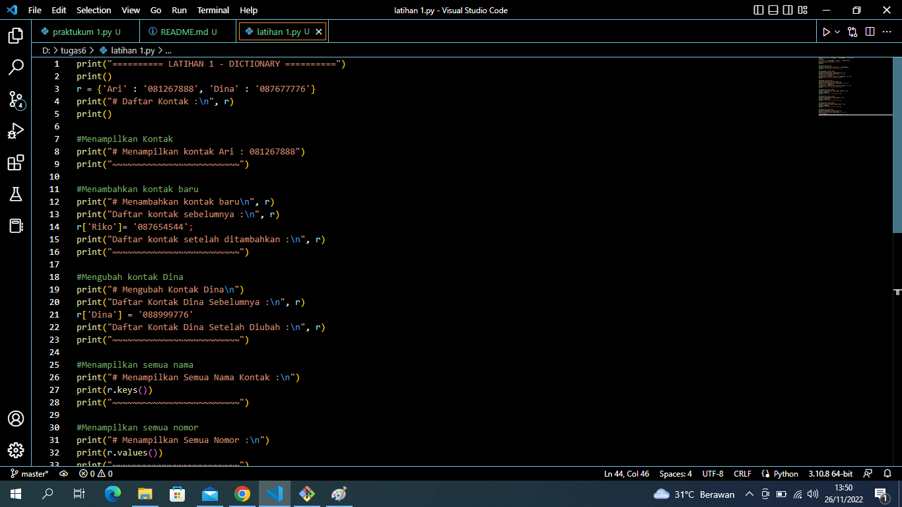

# pertemuan10 

<!-- # Apa itu Dictionary pada Python?  -->


Dictionary adalah stuktur data yang bentuknya seperti kamus. Ada kata kunci kemudian ada nilaninya. Kata kunci harus unik, sedangkan nilai boleh diisi denga apa saja.

## Contoh:


Pada contoh di atas kita membuat sebuah Dictionary bernama aku dengan isi data nama dan URL. nama dan url adalah kunci (key) yang akan kita gunakan untuk mengakses nilai di dalamnya

## Source code




## Pejelasan

• Membuat Dictionary Daftar Kontak. r = {'Ari' : '081267888', 'Dina' : '087677776'}.

• Menampilkan kontak, untuk menampilkan salah satu kontak ialah menggunakan `r['Ari]`. r adalah variabel dictionary, sedangkan `['Ari]` adalah  keys dari sebuah dictionary. Python `print("Menampilkan Kontak Ari: ", r['Ari']`).

• Menambahkan kontak baru menggunakan `variable_dictionary['keys']=value;`. Python `r['Riko']= '087654544';`.

• Mengubah kontak yang lama dengan yang baru, menggunakan `variable_dictionary['keys']=value;`. Disini saya akan mengubah value dari kontak Dina, yang awalnya `'Dina' : '087677776'` menjadi `r['Dina'] = '088999776'`.

• Menampilkan keseluruhan nama pada kontak menggunakan `keys()`. Python `print(r.keys())`.

• Menampilkan keseluruhan nomor kontak menggunakan `values()`. Python `print(r.values())`.

• Menampilkan keseluruhan nama beserta nomor kontak menggunakan `items()`. Python `print(r.items())`

• Untuk menghapus salah satu kontak menggunakan statement `del variable_dictionary[keys];`. Python `del r['Dina'];`


## Hasil Runinng


# ( PRAKTIKUM - DICTIONARY )

## Source Code


## PENJELASAN

1. Membuat Dictionary kosong yang nanti akan diinput dengan sebuah data.

data={}

2. Membuat perulangan dengan while dan terdapat pilihan menu untuk menjalankan program.
```
while True:
print()
a=input("[(L)ihat, (T)ambah, (U)bah, (H)apus, (C)ari, (K)eluar] :")
print()
```
3. Menambahkan data nim, nama, nilai tugas, uts, dan uas. Data yang diinputkan akan masuk ke dalam Dictionary data dengan nim sebagai *keys_. sedangkan, nama, tugas, uts, dan uas sebagai _. sedangkan, nama, tugas, uts, dan uas sebagai _*values*_.
```
if a=="t" or a=="T":
    print("TAMBAH DATA")
    print("-----------")
    nim=int(input("NIM\t: "))
    nama=input("Nama\t: ")
    tugas=int(input("Tugas\t: ")) 
    uts=int(input("UTS\t: "))
    uas=int(input("UAS\t: "))
    akhir=(int(tugas)*30/100)+(int(uts)*35/100)+(int(uas)*35/100)
    data[nim]=nama, tugas, uts, uas, akhir
    print()
```
4. Menambahkan atau melihat data. Jika sebelumnya belum menginput data, maka tampilannya akan "Tidak ada data". Apabila sudah menginput data, maka data yang telah diinput tadi akan ditampilkan.
```
elif a=="l" or a=="L":
    if data.items():
        print("DAFTAR NILAI")
        print("------------")
        print(72*"=")
        print("| {0:^10} | {1:^10} | {2:^6} | {3:^6} | {4:^6} |   {5:^12}  |".format("NIM", "NAMA", "TUGAS", "UTS", "UAS", "NILAI AKHIR"))
        print(72*"=")
        for item in data.items(): 
            print("| {0:>10} | {1:>10} | {2:>6} | {3:>6} | {4:>6} |   {5:>12}  |".format(nim, nama, tugas, uts, uas, akhir))
            print(72*"=")
        print()
    else:
        print("DAFTAR NILAI")
        print("------------")
        print(72*"=")
        print("| {0:^10} | {1:^10} | {2:^6} | {3:^6} | {4:^6} |   {5:^12}  |".format("NIM", "NAMA", "TUGAS", "UTS", "UAS", "NILAI AKHIR"))
        print(72*"=")
        print("|                             TIDAK ADA DATA                           |")
        print(72*"=")
        print()
```
5. Apabila ingin mengubah data, maka anda akan diminta untuk menginput *NIM* terlebih dahulu. setelah itu input data yang ingin diubah.
```
elif a=="u" or a=="U":
        print("UBAH DATA")
        print("~~~~~~~~~~")
        b=input("Masukkan NIM anda: ")
        print()
        if data.keys():
            tugas=int(input("TUGAS\t: ")) 
            uts=int(input("UTS\t: "))
            uas=int(input("UAS\t: "))
            akhir=(int(tugas)*30/100)+(int(uts)*35/100)+(int(uas)*35/100)
```
6. Jika ingin menghapus data, anda akan diminta untuk menginput *NIM*terlebih dahulu. Lalu data yang telah diinput diawal tadi akan dihapus beserta _values_nya (nama, nilai tugas, nilai uts, dan nilai uas).
```
elif a=="h" or a=="H":
        print("HAPUS DATA")
        print("~~~~~~~~~~~")
        b=input("Masukkan NIM anda: ")
        print()
        if data.keys():
            del data[nim]
```
7. Apabila ingin mencari data, anda akan diminta untuk menginput *NIM* kemudian data yang anda cari akan muncul berdasarkan nim yang diinput tadi.
```
elif a=="c" or a=="C":
        print("CARI DATA")
        print("~~~~~~~~~~")
        b=input("Masukkan NIM anda: ")
        print()
        if data.keys():
            print(72*"=")
            print("| {0:^10} | {1:^10} | {2:^6} | {3:^6} | {4:^6} |   {5:^12}  |".format("NIM", "NAMA", "TUGAS", "UTS", "UAS", "NILAI AKHIR"))
            print(72*"=")
            print("| {0:>10} | {1:>10} | {2:>6} | {3:>6} | {4:>6} |   {5:>12}  |".format(nim, nama, tugas, uts, uas, akhir))
            print(72*"=")
            print()
```
8. Jika data sudah selesai diinput, pilih menu 'k'/'K' maka program akan terhenti.
```
 elif a=="k" or a=="K":
         break
```

## OUTPUT


## FLOWCHART


